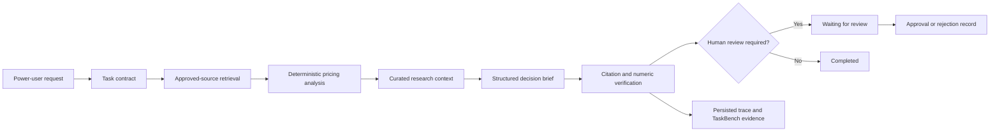

# EvidenceOps

<p align="center">
  <strong>Governed AI decision workflows with evidence, verification, evaluation, and human approval.</strong>
</p>

<p align="center">
  <a href="#quick-start">Quick start</a> ·
  <a href="#how-it-works">How it works</a> ·
  <a href="#evaluation-control-plane">Evaluation</a> ·
  <a href="#validation-snapshot">Validation</a> ·
  <a href="#documentation">Documentation</a>
</p>

<p align="center">
  
  
  
  
  <a href="LICENSE"></a>
</p>

> **Portfolio reference implementation** — EvidenceOps demonstrates how a power user can delegate a complex, read-only decision task without losing control of the sources, calculations, workflow trace, quality checks, or final approval.

EvidenceOps converts a broad business request and an approved evidence set into an **auditable decision brief**. It uses a bounded state graph to create a typed task contract, retrieve approved sources, run deterministic total-cost analysis, draft structured findings, verify citations and numbers, persist execution events, and stop for human review.

The project is deliberately designed around **controlled delegation**, not unconstrained agent autonomy.

| Input | Controlled execution | Output |
|---|---|---|
| Business request, approved internal documents, pricing data, curated public research note | Task contract → retrieval → deterministic analysis → brief generation → verification → human review | Cited recommendation, TCO calculation, identified risks, unresolved questions, review-ready trace |

## Why EvidenceOps

Most LLM demos optimize for a fluent answer. Enterprise decision support requires more: a bounded workflow, approved evidence, reproducible calculations, visible uncertainty, traceability, and a way to measure whether a change made the system better or worse.

EvidenceOps makes that operating model concrete through a vendor-selection workflow. It demonstrates how an AI system can prepare a recommendation while preserving the controls a reviewer needs to trust or reject it.

### What this repository demonstrates

| Capability | Implementation in EvidenceOps | Why it matters |
|---|---|---|
| **Bounded agent orchestration** | Explicit LangGraph state graph with six narrow workflow stages | Avoids hidden loops and makes execution inspectable |
| **Evidence-grounded outputs** | Every material decision claim must cite retrieved, tenant-scoped source chunks | Reduces unsupported recommendations |
| **Deterministic analysis** | pandas-based three-year total cost of ownership calculation | Keeps business arithmetic outside model reasoning |
| **Independent verification** | Citation coverage, citation precision, numeric reconciliation, and escalation checks | Does not rely only on an LLM judge |
| **Human approval** | Consequential outputs pause in `waiting_for_review` | Keeps the default workflow read-only and reviewable |
| **Evaluation control plane** | Versioned TaskBench, profile comparison, composite metrics, and regression gates | Supports measurable, continuous improvement |
| **Observable execution** | Persisted run events, stage latency, verifier outcomes, and redaction-aware trace payloads | Makes failures diagnosable rather than anecdotal |
| **Policy-aware routing seam** | Configured `enterprise-fast`, `enterprise-balanced`, and `enterprise-precise` profiles | Supports task-specific quality, latency, and cost trade-offs |

## How it works



### Workflow stages

1. **Build task contract** — Converts the request into a typed objective, deliverable, approved source types, quality bar, constraints, and escalation conditions.
2. **Retrieve evidence** — Searches only the documents available to the task tenant and records source references with document ID, chunk ID, excerpt, section, score, and source type.
3. **Analyze pricing** — Calculates three-year total cost of ownership with the defined procurement contingency using deterministic pandas logic.
4. **Add research context** — Uses the included curated public-governance note when the task permits it. This reference implementation does **not** perform unrestricted live web crawling.
5. **Draft decision brief** — Produces executive summary, recommendation, rationale, trade-offs, structured findings, claims, assumptions, unresolved questions, and next actions.
6. **Verify and route for review** — Validates evidence and numeric claims, raises issues, calculates a quality score, and pauses for review when required.

## Product surfaces

| Surface | What a reviewer can inspect |
|---|---|
| **Control Room** | Workflow volume, review queue, quality signals, open issues, and the latest evaluation snapshot |
| **Task Studio** | Create a task, choose an approved model policy, execute the bounded workflow, and submit a review decision |
| **Run Detail** | Task contract, retrieved evidence, cost analysis, structured brief, verifier output, and persisted execution trace |
| **Evaluation Lab** | Versioned TaskBench cases, profile configurations, fair comparison results, latency, cost estimates, and composite scores |
| **Architecture View** | Workflow boundaries, data controls, provider seams, and production evolution path |

## Architecture

```text
Frontend: Next.js + TypeScript
    │
    ▼
FastAPI API
    │
    ├── Task orchestration ── LangGraph workflow state graph
    ├── Retrieval ─────────── tenant-scoped hybrid ranking over approved documents
    ├── Tools ─────────────── deterministic pricing/TCO analysis
    ├── Provider seam ─────── local deterministic provider or guarded OpenAI-compatible adapter
    ├── Verification ──────── citation, numeric, escalation, and quality rules
    ├── Evaluation ────────── TaskBench runner and profile comparison
    ├── Observability ─────── persisted events + optional OpenTelemetry export
    └── Persistence ───────── SQLAlchemy + SQLite for the local reference deployment
```

### Design principles

- **Evidence before eloquence** — A concise, source-supported conclusion is preferred to an expansive unsupported narrative.
- **Deterministic tools for deterministic work** — Pricing and numerical reconciliation are performed outside the model.
- **Typed contracts between stages** — Nodes exchange structured state rather than unvalidated prose.
- **Read-only by default** — The reference workflow cannot send email, execute payment, delete records, or sign contracts.
- **Human review for consequential output** — A verifier score does not replace an accountable reviewer.
- **Evaluation is part of the product** — Every meaningful reliability improvement should become a regression case.

## Evaluation control plane

EvidenceOps includes a small, versioned **TaskBench** designed for the vendor-selection workflow. It evaluates not just final wording, but whether the system completed the task with the required evidence, calculations, and escalation behavior.

### Included task families

| Task family | What it tests |
|---|---|
| End-to-end vendor selection | Contract → retrieve → calculate → brief → verify flow |
| Grounding and policy | Whether material claims use required approved sources |
| Numeric reconciliation | TCO calculation and procurement-contingency handling |
| Governance research | Approved-source restriction and evidence framing |
| Adversarial unsupported instruction | Escalation instead of following an evidence-free directive |

### Metrics

| Metric | Definition |
|---|---|
| **Task completion** | Required answer fragments, expected vendor where applicable, and expected source usage |
| **Citation coverage** | Share of material claims that include grounded support |
| **Citation precision** | Share of citations that belong to the run’s approved retrieval set |
| **Numeric accuracy** | Share of material numerical claims that reconcile to deterministic tool output |
| **Escalation correctness** | Whether the system escalates when a labelled condition requires it |
| **Composite score** | Weighted release-gate signal; never a replacement for diagnostics |
| **Latency** | Observed end-to-end execution time |
| **Estimated cost** | Configured policy cost estimate used for trade-off analysis |

### Fair model-comparison rule

A real model comparison must hold constant the **TaskBench version**, **approved document corpus**, **retrieval configuration**, **available tools**, **output schema**, and **verification rules**. Only the selected model profile or a single workflow policy should differ.

The repository includes three profiles:

| Profile | Intended use | Quality bias | Cost index | Latency target |
|---|---|---:|---:|---:|
| `enterprise-fast` | Extraction, routing, low-complexity drafting | 0.67 | 0.4× | 1.8 s |
| `enterprise-balanced` | Normal cross-document decision briefs | 0.82 | 1.0× | 4.2 s |
| `enterprise-precise` | High-ambiguity or higher-risk analysis | 0.92 | 2.4× | 8.2 s |

> [!IMPORTANT]
> In the local reference implementation, all profiles use the same deterministic provider. The comparison runner validates **evaluation infrastructure and report plumbing**, not real foundation-model superiority. Connect approved providers and rerun the TaskBench before making performance claims.

## Validation snapshot

The repository was validated locally against the bundled synthetic corpus on **21 June 2026**. Full details are available in [docs/validation.md](docs/validation.md).

| Check | Result |
|---|---|
| Backend unit and integration tests | **7 passed** |
| Backend quality | Ruff and mypy passed |
| Frontend quality | TypeScript and ESLint passed |
| Production frontend generation | Next.js build artifact created successfully |
| Live task result | `waiting_for_review` |
| Provisional recommendation | `Northstar` |
| Citation coverage | `1.00` |
| Citation precision | `1.00` |
| Numeric accuracy | `1.00` |
| Quality score | `0.84` |
| Persisted execution events | `9` |

The quality score is intentionally below `1.00` because the demo scenario retains governance questions for a human reviewer. This is expected behavior for a consequential decision-support workflow.

## Quick start

### Prerequisites

- Docker Desktop and Docker Compose **or**
- Python `3.11+`
- Node.js `22+`
- npm `10+`

### Option A — run the full stack with Docker Compose

```bash
# Clone your fork or repository, then enter the project directory.
cp .env.example .env

docker compose up --build
```

Open:

- Dashboard: `http://localhost:3000`
- OpenAPI documentation: `http://localhost:8000/docs`
- Health endpoint: `http://localhost:8000/health`

Windows PowerShell equivalent:

```powershell
Copy-Item .env.example .env
docker compose up --build
```

### Option B — run backend and frontend locally

**Terminal 1 — API**

```bash
cd backend
python -m venv .venv
source .venv/bin/activate
python -m pip install --upgrade pip
python -m pip install -e '.[dev]'
uvicorn app.main:app --reload --port 8000
```

Windows PowerShell:

```powershell
cd backend
py -3.11 -m venv .venv
.\.venv\Scripts\Activate.ps1
python -m pip install --upgrade pip
python -m pip install -e '.[dev]'
uvicorn app.main:app --reload --port 8000
```

**Terminal 2 — dashboard**

```bash
cd frontend
npm install
npm run dev
```

The backend seeds the synthetic demo corpus on startup. No external model key is needed for the default deterministic provider.

## Run the demo workflow

Open **Task Studio** in the dashboard, or execute the API request directly.

```bash
curl -X POST http://localhost:8000/api/v1/tasks/runs \
  -H 'Content-Type: application/json' \
  -H 'X-Tenant-ID: demo-tenant' \
  -d '{
    "title": "Vendor selection decision brief",
    "request": "Review the approved vendor documents, compare vendors against internal security requirements, calculate a three-year total cost of ownership, identify policy gaps, and prepare a management decision brief with evidence citations. Escalate any unsupported conclusion.",
    "model_profile": "enterprise-balanced",
    "require_human_review": true
  }'
```

Expected outcome:

1. A structured task contract is created.
2. Approved evidence is retrieved from the synthetic corpus.
3. Three-year TCO calculations are generated deterministically.
4. The decision brief contains cited claims and unresolved questions.
5. Verification checks run before the result is persisted.
6. The run stops in `waiting_for_review` until an explicit review decision is recorded.

### Record a reviewer decision

```bash
curl -X POST http://localhost:8000/api/v1/tasks/runs/<RUN_ID>/review \
  -H 'Content-Type: application/json' \
  -H 'X-Tenant-ID: demo-tenant' \
  -d '{
    "decision": "approved",
    "reviewer": "demo.reviewer",
    "comment": "Evidence and calculations reviewed."
  }'
```

### Run the TaskBench

```bash
curl -X POST http://localhost:8000/api/v1/evaluations/runs \
  -H 'Content-Type: application/json' \
  -H 'X-Tenant-ID: demo-tenant' \
  -d '{
    "model_profiles": [
      "enterprise-fast",
      "enterprise-balanced",
      "enterprise-precise"
    ]
  }'
```

You can also run the included convenience commands:

```bash
make backend-test
make backend-lint
make frontend-lint
make demo
```

## API at a glance

Interactive endpoint documentation is available at `/docs` while the API is running.

| Method | Endpoint | Purpose |
|---|---|---|
| `GET` | `/health` | Service health check |
| `GET` | `/api/v1/dashboard/summary` | Control Room summary and recent runs |
| `POST` | `/api/v1/tasks/runs` | Create and execute a governed decision workflow |
| `GET` | `/api/v1/tasks/runs` | List runs for the active tenant scope |
| `GET` | `/api/v1/tasks/runs/{run_id}` | Inspect the brief, evidence, verification, review, and events |
| `POST` | `/api/v1/tasks/runs/{run_id}/review` | Approve, reject, or request changes |
| `POST` | `/api/v1/tasks/knowledge/documents` | Add a structured text knowledge document to the tenant corpus |
| `GET` | `/api/v1/evaluations/cases` | Inspect available TaskBench cases |
| `GET` | `/api/v1/evaluations/model-profiles` | Inspect model-policy configurations |
| `POST` | `/api/v1/evaluations/runs` | Run a benchmark across selected profiles |

## Configuration

Copy `.env.example` to `.env`. The default settings are intentionally safe for local demonstration.

| Variable | Default | Purpose |
|---|---|---|
| `ENVIRONMENT` | `development` | Runtime environment label |
| `DATABASE_URL` | `sqlite:///./evidenceops.db` | SQLAlchemy persistence connection |
| `DEFAULT_TENANT_ID` | `demo-tenant` | Local tenant scope used when no header is supplied |
| `ENABLE_REMOTE_MODEL` | `false` | Enables the guarded OpenAI-compatible provider seam |
| `OPENAI_COMPATIBLE_BASE_URL` | OpenAI-compatible base URL | Remote endpoint when explicitly enabled |
| `OPENAI_COMPATIBLE_API_KEY` | empty | Remote provider credential; never commit this value |
| `OPENAI_COMPATIBLE_MODEL` | empty | Model name for the remote provider |
| `OTEL_EXPORTER_OTLP_ENDPOINT` | empty | Optional OpenTelemetry collector endpoint |
| `STORE_REDACTED_TRACE_PAYLOADS` | `true` | Stores redacted trace attributes rather than unrestricted payloads |

### Remote-model integration

Remote inference is **disabled by default**. Before enabling it, confirm that you have:

1. An approved provider endpoint and model.
2. A valid data-processing basis for any content that could leave the tenant boundary.
3. A tenant-specific allow-list, retention policy, and review threshold.
4. Baseline and candidate TaskBench results for the intended task family.

The project includes an OpenAI-compatible adapter seam so a real model can be introduced without changing the workflow, verification, or evaluation contracts.

## Quality and engineering controls

### Local quality commands

```bash
# Backend
cd backend
pytest -q
ruff check app tests
mypy app

# Frontend
cd ../frontend
npm run lint
npm run typecheck
npm run build
```

### Continuous integration

GitHub Actions runs the following checks on pushes to `main` and pull requests:

- backend dependency installation
- Ruff linting
- mypy type checking
- pytest with coverage output
- frontend `npm ci`
- ESLint
- TypeScript type checking
- Next.js production build

### Contribution standard

Reliability changes should follow this sequence:

```text
Observed failure or reviewer feedback
  → labelled TaskBench case
  → isolated workflow or prompt change
  → targeted test and full relevant benchmark replay
  → CI gate
  → reviewed merge
```

See [CONTRIBUTING.md](CONTRIBUTING.md) for the pull-request checklist.

## Security and governance posture

EvidenceOps is a local reference system, not a security-certified deployment. It nevertheless demonstrates concrete controls that should exist before a decision-support workflow is trusted with sensitive enterprise work.

| Control | Reference implementation | Production evolution |
|---|---|---|
| Tenant scope | Database filtering via tenant identifier | Verified OIDC/SAML claims and row-level security |
| Source boundary | Task-scoped approved document IDs and source metadata | Connector allow-lists, provenance checks, content scanning |
| Claim grounding | Citation references drawn from retrieved evidence | Entailment checks and critical-claim thresholds |
| Numerical accuracy | pandas calculation and reconciliation rule | Versioned signed calculation artifacts |
| External actions | Read-only workflow and explicit review gate | Capability tokens, approval workflow, immutable audit log |
| Telemetry | Persisted events plus redaction-aware tracing | DLP, encryption, retention policies, role-based access |
| Provider risk | Default local provider; remote inference opt-in | Model pinning, canaries, rollback, and continuous evaluation |

See [SECURITY.md](SECURITY.md) and [docs/threat_model.md](docs/threat_model.md) for scope, threats, and limitations.

## Project structure

```text
EvidenceOps/
├── backend/
│   ├── app/
│   │   ├── api/                 # FastAPI routes and dependencies
│   │   ├── workflow/            # LangGraph state, nodes, and orchestration
│   │   ├── retrieval/           # Tenant-scoped hybrid retrieval and knowledge store
│   │   ├── tools/               # Deterministic pricing and research utilities
│   │   ├── verification/        # Claim, citation, numeric, and quality checks
│   │   ├── evaluation/          # TaskBench runner and scorers
│   │   ├── observability/       # OpenTelemetry wrapper and safe trace handling
│   │   └── services/            # Run lifecycle and demo seeding
│   ├── data/taskbench/          # Versioned evaluation cases
│   └── tests/                   # Unit and integration tests
├── frontend/
│   └── src/app/                 # Next.js App Router screens
├── docs/
│   ├── adr/                     # Architecture decision records
│   ├── architecture.md
│   ├── evaluation_protocol.md
│   ├── model_routing.md
│   ├── threat_model.md
│   └── demo_walkthrough.md
├── scripts/                      # Bootstrap and demo helpers
├── .github/workflows/ci.yml      # CI quality gates
├── docker-compose.yml
└── Makefile
```

## Documentation

| Document | Purpose |
|---|---|
| [Architecture](docs/architecture.md) | System components, state model, provider seam, data boundaries, and production evolution |
| [Evaluation protocol](docs/evaluation_protocol.md) | TaskBench design, metrics, fair comparison rules, release gates, and human evaluation |
| [Model routing strategy](docs/model_routing.md) | Policy-based model selection and replayable routing decisions |
| [Threat model](docs/threat_model.md) | Assets, threat scenarios, controls, invariants, and logging guidance |
| [Demo walkthrough](docs/demo_walkthrough.md) | Five-minute interview or stakeholder demonstration flow |
| [Validation record](docs/validation.md) | Local quality checks and live API smoke-test results |
| [Architecture decisions](docs/adr/) | Rationale for bounded state graphs and deterministic verification |

## Scope and limitations

EvidenceOps is intentionally opinionated and transparent about what it is not.

- The bundled corpus is **synthetic** and exists only to make the repository runnable without confidential data.
- The default provider is **deterministic**, not a claim of production-grade model intelligence.
- The current knowledge-document endpoint accepts **structured text**. Production-grade PDF, DOCX, spreadsheet ingestion, OCR, malware scanning, and content-classification pipelines are future integration work.
- Public research is represented by a **curated local note**, not live unrestricted web retrieval.
- The `X-Tenant-ID` header is a **development seam**, not authentication or authorization.
- SQLite and in-process execution are appropriate for a local reference build, not a scaled multi-tenant production deployment.
- The default workflow is **read-only**. It intentionally cannot perform irreversible external actions.

## Suggested production roadmap

1. Replace the header-based tenant seam with OIDC/SAML, RBAC, and row-level database enforcement.
2. Add safe document ingestion for PDF, DOCX, XLSX, OCR, parsing quality checks, malware scanning, and provenance metadata.
3. Introduce PostgreSQL, a durable LangGraph checkpointer, background workers, and a governed vector store with embedding versioning.
4. Connect tenant-approved model providers, run real TaskBench comparisons, and add canary routing with rollback.
5. Export traces to an OpenTelemetry collector and apply DLP, encryption, retention, and audit policy controls.
6. Add scoped write actions only behind capability tokens, explicit approvals, idempotency controls, and immutable audit records.

## Contributing

Contributions should improve reliability, safety, maintainability, or developer usability without weakening the bounded-workflow design.

Before opening a pull request:

- Add focused tests for new behavior.
- Add or update a TaskBench case when repairing a reliability failure.
- Run backend and frontend quality checks.
- Document material data-flow, security, or evaluation impact.
- Never commit secrets, raw customer data, access tokens, or unredacted production traces.

See [CONTRIBUTING.md](CONTRIBUTING.md) for the full checklist.

## Security

Report a vulnerability according to [SECURITY.md](SECURITY.md). Do not open a public issue containing sensitive exploit details, credentials, or customer data.

## License

Distributed under the [MIT License](LICENSE).
